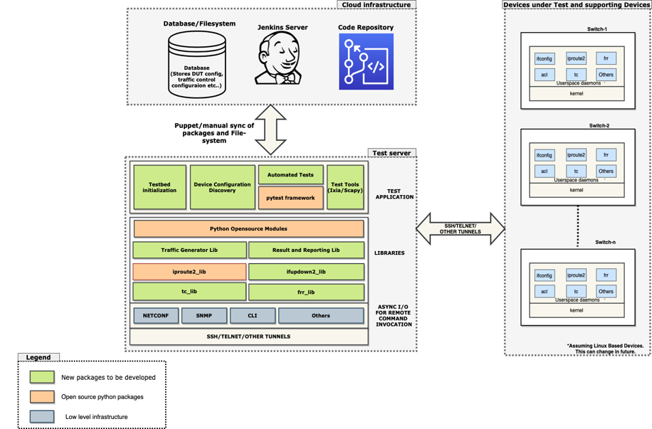
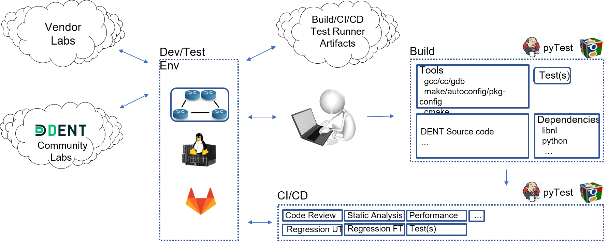

# Feature Test Bed

## Functional test bed (Vendor)

* Scaled down version of SIT lab
* Need not be multi vendor
* Used before the commit test to ensure successful commits
* Test can be community + member tests

## Functional test bed (Community)

* Location TBD
* New features not eligible yet for SIT
* Essential if commit fail due to lack of testing, in vendor labs, before the commit
* Need to be sponsored by Linux Foundation or each member

## DENT PyTest Framework

## Functional or development testing environment

