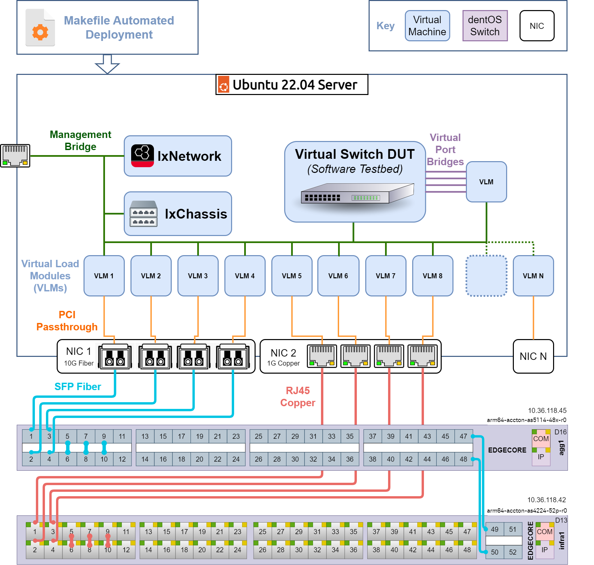

# Description

This file documents the VM Testbed setup using IxNetwork, IxChassis, and Card/Load Module VMs on an Ubuntu 22.04 Server with connected NIC:



## Table of content

1. [Hardware Requirements](#hardware-requirements)
1. [Hardware Setup](#hardware-setup)
1. [VM Installation Steps](#vm-installation-steps)
1. [License VMs](#license-vms)

## Hardware Requirements

* 1+ DentOS Devices.
* 1 Linux with Ubuntu 22.04 Server
* 1 NIC per DentOS DUT

### Server Requirements

#### CPU

With 6-15 active VMs at 4 virtual CPUs each, best performance is achieved with 32 cores. 16 may be acceptable at the cost of throughput.

#### RAM

##### Minimum

* 2 GB reserved for Ubuntu Server
* 4 GB for IxNetwork
* 2 GB for IxChassis
* 2 GB per Virtual Load Module
* 1 GB per DentOS VM

16 GB for 4-port setup, 32 GB for 12-port setup including Dent-VM

##### Recommended

* 2 GB reserved for Ubuntu Server
* 4 GB per IxNetwork, IxChassis, and Load Module VM

32 GB for 4-port setup, 64 GB for 12-port setup including Dent-VM

#### Disk

* 25 GB for Ubuntu Server Installation
* 13 GB for IxNetwork VM
* 5 GB for IxChassis VM
* 2 GB per Virtual Load Module VM
* 20 GB for DentOS VM

Total: 75-100 GB depending on setup

## Hardware Setup

### Install OS

* Install Ubuntu[^1] 22.04 x64 on the server. ([ubuntu-22.04.1-live-server-amd64.iso](https://releases.ubuntu.com/22.04/))
  * select all default options (unless otherwise noted bellow)
  * on disk setup: disable LVM (optional)
  * on profile setup: put name, servername, username, password all as `dent` for example purposes
  * on ssh setup: enable `install OpenSSH server`
* Install Ubuntu prerequisites

```Shell
    sudo apt -y update
    sudo apt -y upgrade
    sudo apt -y autoremove
    sudo apt -y install \
      python3 \
      python3-pip \
      net-tools \
      curl \
      git \
      make \
      lbzip2
```

* Install KVM prerequisites

```Shell
    sudo apt -y install cpu-checker
    sudo kvm-ok
    sudo apt -y install qemu-kvm libvirt-daemon-system libvirt-clients bridge-utils virtinst virt-manager libosinfo-bin bzip2
    sudo usermod -aG libvirt $USER
    sudo usermod -aG kvm $USER
    sudo systemctl enable libvirtd
    sudo systemctl start libvirtd
```

### Configure PCI Passthrough

PCI Passthrough enables each Load Module VM to control its own NIC port. This requires enabling Virtualization, IOMMU, and/or VT-D in your BIOS. This will depend on your BIOS manufacturer. Once done, it can be configured in Ubuntu.

* Edit your grub configuration based on your processor type:
  * Intel CPU: edit `/etc/default/grub` to include `GRUB_CMDLINE_LINUX="intel_iommu=on"`
  * AMD CPU: edit `/etc/default/grub` to include `GRUB_CMDLINE_LINUX="amd_iommu=on"`
* Apply the new grub configuration with `sudo update-grub`
* Reboot, PCI Passthrough should now be possible during the VM Installation step.

## VM Installation Steps

Automatically install by downloading the images below and configuring the Makefile in `dent-testing/vms`.

Once configured, run `make deploy` to run all installation steps.

### Download VM Images

Download the following three compressed VM images to `dent-testing/vms` or `dent-testing/vms/download`

* [IxNetwork VM](https://downloads.ixiacom.com/support/downloads_and_updates/public/ixnetwork/9.30/IxNetworkWeb_KVM_9.30.2212.22.qcow2.tar.bz2)

* [IxChassis VM](https://downloads.ixiacom.com/support/downloads_and_updates/public/IxVM/9.30/9.30.0.328/Ixia_Virtual_Chassis_9.30_KVM.qcow2.tar.bz2)

* [IxLoadModule / Card VM](https://downloads.ixiacom.com/support/downloads_and_updates/public/IxVM/9.30/9.30.0.328/Ixia_Virtual_Load_Module_IXN_9.30_KVM.qcow2.tar.bz2)

### Configure MAC Addresses and PCI Addresses

This network setup is intended to work with static IP reservations rather than with DHCP requests. This means that the Ubuntu Server, IxNetwork VM, IxChassis VM, and any number of IxLoadModule VMs need to be given IP reservations by your network's router or DHCP Server.

Edit the `MANUAL CONFIG` section of the Makefile in the dent-testing/vms folder:

* Edit the `CLIENT_MAC`, `CHASSIS_MAC`, and `LOAD_MAC` lists to hold unique mac addresses for each VM. Give each of these addresses a desired IP Reservation.
* Edit the `CTL_MAC` to a hold unique mac addresses to be used for a network bridge on the server.
* Assign both your server's primary ethernet mac address and the `CTL_BRIDGE` mac address an identical IP. This way, when a bridge is created on the network adapter, the server's primary IP will not change.
With these mac addresses and reservations, the VMS should start with known IP addresses.

The Ethernet Ports to be used with PCI Passthrough also need to be set up in  `MANUAL CONFIG`  for automated installation:

* Use `lspci` to find the PCI Addresses of the Ethernet Ports to be used by the load modules, for example `AB:12.3`
* Use `virsh nodedev-list` to find the associated libvirt known device with each port, for example `pci_0000_ab_12_3`
* Fill in the PCI address of each ethernet port into the `LOAD_PCI` list in the Makefile

### Deploy VMS

With the previous two steps complete, VMs are ready to be deployed.

* `make deploy` will automatically configure the network, extract, and install the VMs based on the Makefile configuration.

* `make` or `make help` will list available installation steps in case a step fails or for manual installation

The installation process is described below for manual installation.

#### Setup Network

A VM must be able to access the network through a bridge connected to the server's main ethernet adapter. This is done in Ubuntu using netplan.

Automatic: `make bridge_configure`

Manual:

* setup management port configuration using this sample by editing `/etc/netplan/00-installer-config.yaml`:

```Yaml
---
network:
  ethernets:
    eth_used: # Connected Ethernet Device (maybe eth0)
      dhcp4: false
      dhcp6: false
    eth_unused: # Unused Ethernets
      dhcp4: false
      dhcp6: false
      optional: true  # Set optional for faster boot time
  bridges:
    br1:
      interfaces: [eth_used] # Bridge connected to ethernet
      addresses: [10.36.118.11/24] # Server IP
      routes:
        - to: default
          via: 10.36.118.1  # Default Gateway
      mtu: 1500
      nameservers:
        addresses: [1.1.1.1, 8.8.8.8, 156.140.198.11, 156.140.214.11]
      parameters:
        stp: false
        forward-delay: 0
        max-age: 0
      dhcp4: false
      dhcp6: false
  version: 2
  # Network Renderer Choice: Network Manager can be installed for GUI support, but unncessary
  renderer: networkd
  # renderer: NetworkManager
```

* check the yaml file is ok (optional)

```Shell
sudo apt -y install yamllint
yamllint /etc/netplan/00-installer-config.yaml
```

* Apply Netplan and Edit Firewall Settings to allow IxNetwork DHCP Resolution on bridge:

```Shell
    sudo netplan apply
    sudo ufw allow in on br1
    sudo ufw route allow in on br1
    sudo ufw route allow out on br1
```

* reboot
  * ensure networking is working, for example verify output received from ```curl www.google.com```
  * If this fails, check that IP Reservations on router or DHCP Server match the bridge

#### Extract and Copy VMs

Automatic: `make extract` then `make vm_overwrite`

Manual:

* `tar -xf FILE.qcow2.tar.bz2 --use-compress-program=lbzip2` for each
* Make as many copies of the load module VM (.qcow2) file as you need load modules

#### Install VMs

Automatic: `make vm_install`

Manual:

For the IxNetwork and IxChassis VMs, install using this formula:

```Shell
virt-install --name IxNetwork-930 --memory 8000 --vcpus 4 \
    --disk CLIENT.qcow2,bus=sata --import --os-variant centos7.0 \
    --network bridge=br1,model=virtio,mac=CLIENT_MAC--noautoconsole
virsh autostart IxNetwork-930
```

For the IxLoadModule VMs, install using this formula:

```Shell
virt-install --name IxLoadN-930 --memory 4000 --vcpus 4 \
    --disk LOADN.qcow2,bus=sata --import --osinfo detect=on,require=off \
    --network bridge=br1,model=virtio,mac=LOAD_MAC_N --noautoconsole \
    --host-device=PCI_N
virsh autostart IxLoadN-930
```

* Check that the VMs have expected IP for each VM:

```Shell
    virsh console IxNetwork-930 --safe
```

  if a dhcp server is present we can observe the IP assigned

```code
  dent@dent:~$ virsh console IxNetwork-930 --safe
  Connected to domain 'IxNetwork-930'
  Escape character is ^] (Ctrl + ])

  CentOS Linux 7 (Core)
  Kernel 3.10.0-693.21.1.el7.x86_64 on an x86_64

  Ixia
  System initializing, it may take few seconds to become available.

  The IPv4 address is 10.36.118.214 (MAC address 52:54:00:9e:4e:8f)
  Enter `https://10.36.118.214` in your web browser to access the application
  The IPv6 link-local address is fe80::5054:ff:fe9e:4e8f
  The IPv6 global address is not configured
  To change the IP address, log in as admin (password: admin) below
```

## License VMs

Before tests can be run, IxNetwork VE and IxChassis VE must be licensed. The IxLoadModule VMs will use licenses based on their connected Chassis. From the start page of the IxNetwork and IxChassis, navigate Settings Gear -> Administration/System -> License Manager for an easy way to locally host a license. Once licensed, see the doc on [running test cases](How_to_start_and_run_testcases.md).
