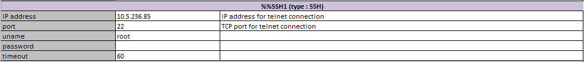
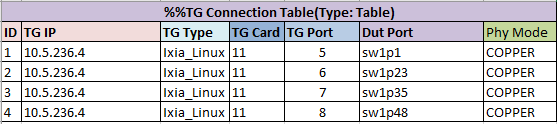
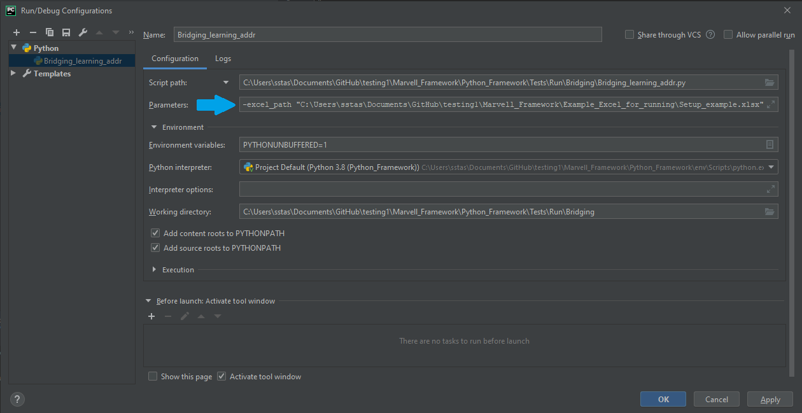
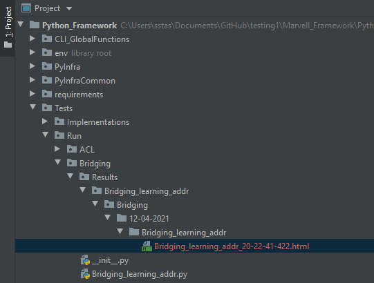

# 1	 Installing Python Marvell Automation Framework

Marvell Python Automation Framework
incorporates a built-in Python virtual environment, with full library dependencies. This allows installing a standard Python package from [https://www.python.org/downloads/](https://www.python.org/downloads/), and launching tests with no additional requirements, except having a Python version 3.7.4 installed.

Note, that users may use a higher Python version, which may require installation of adequate dependencies.

This guide includes instructions and guidelines for installation per each of the usage modes:
- Using Python Framework with the Built-in Virtual Environment
- Using other Python Framework Environments

> **Note:**
> - Though Python is a cross-platform environment, Marvell does not run the tests on a Linux environment, requiring Linux users make the appropriate adjustments
> - For Windows users, this guide assumes usage of Windows 7 and above

## 1.1 Using Python Framework Environments

To use Marvell built-in environment, download and Install Python 3.8.3 64-bit for Windows from [https://www.python.org/ftp/python/3.8.3/python-3.8.3-amd64.exe](https://www.python.org/ftp/python/3.8.3/python-3.8.3-amd64.exe).

## 1.2 Using Other Python Framework Environments

Using a Python Framework environment other than the one provided by Marvell, requires the following adjustments:
1. Download and Install Python 64-bit, version of 3.8.3 and on – see [https://www.python.org/downloads/](https://www.python.org/downloads/).
2. Install Python dependencies based on the **requirements.txt**  file provided within the framework under Python_Framework\requirements\requirements.txt.
For example: 
`cd Python_Framework\ pip install -r requirements\requirements.txt`

	> **Note:** Using a Python version higher than 3.8.3, may require using a higher package version for some of the packages. If it does, edit the requirements_for_custom_python_environments.txt file, and for each requirement, replace the == operator with >=. For example, change alabaster==0.7.12 to alabaster>=0.7.12.
	
3.	Copy Marvell proprietary open-source custom libraries from **Python_Framework\requirements\python_libraries_for_custom_python_environments**  (within framework package) to your Python installation location under its Lib\site-packages folder. For example, assuming Python is installed under **C:\Program Files\Python38**, copy libraries to **C:\Program Files\Python38\Lib\site-packages**.
	> **Note:** Using your own Python virtual environment requires copying the virtual environment path instead  		of the system Python folder as in the example above.

# 2 Running Tests in Marvell Python Automation Framework

## 2.1 Prerequisites
### 2.1.1 Setup Preparation

Prepare a switch setup with an IP address configured, and four Traffic Generator ports, such as Ixia, connected.

### 2.1.2 Generating an Excel Sheet Matching Local Setup

For each test, Marvell framework uses an Excel sheet defining access to switch and traffic generator. Excel location is specified by a command line argument.

An example for this Excel is in this package, under **Example_Excel_for_running/Setup_example.xlsx**.

To adapt the Excel to specific system requirements:

1. Save the setup Excel to a destination accessible from the computer running the Python test.
2. Open the Excel, and modify the following fields:
	* In the **SetupInfo** sheet, locate the %%SSH1(type:ssh) row, and modify:
	**IP address** to your switch IP address
	**uname** to your switch username
	**password** field to your switch password
	
	* In the **TG_ConnectionTable** Sheet, for each of the four ixia ports’ access settings in the table, modify:
	**TG IP** to the Ixia IP address
	**TG Card** to the Ixia card number
	**TG Port** to the Ixia Port number
	**Dut Port** to the interface name of the switch connected it the Ixia; for example: sw1p1
	When using an Ixia with a dual mode card supporting both copper and fiber ports, modify **Phy Mode** to **FIBER** or **COPPER**, depending on the specific connection type.
	

## 2.2 Running Tests

Marvell framework and tests are located in package under the **Python_Framework** folder.
To run the tests, locate the **Python_Framework\Tests\Run**folder, and select the test to run from the feature/topic respective folder.

### 2.2.1 Running Test through Command Line

1.	Locate the **python.exe** in your Python environment. Using Python from the virtual environment provided by this package, requires running python.exe from the folder **Python_Framework\testenv\Scripts\**.

	When using a different Python environment, assuming the user made the required adjustments listed in section ‎1.2, Using Python With/Without a Virtual Environment, the **Python.exe** file location may vary, likely under **\<Python installation path\>/\<Virtual Environment\>**

2. Run test using the **Python.exe** file as follows:
`python.exe -excel_path=<path to your setup excel> <path to your test run file>`

	Where:
	- `<path to your setup excel>` is the full path of the Excel file described in section 2, Setup Preparation
	- `<path to your test run file>` is the path of the test file to run

	For example:
	`python.exe -excel_path=C:\Users\myuser\Example_Excel_for_running \Setup_example.xlsx C:\Users\myuser\Marvell Python Framework\Tests\Run\Bridging\Bridging_learning_addr.py`

This command runs the **Bridging_learning_addr.py** test with an Excel located under **C:\Users\myuser\Marvell Example_Excel_for_running\Setup_example.xlsx**.

### 2.2.2 Running Test through PyCharm IDE

1. Under the interpreter settings, set the Python interpreter to the Python’s virtual environment in use. For more information, see [https://www.jetbrains.com/help/pycharm/configuring-python-interpreter.html](https://www.jetbrains.com/help/pycharm/configuring-python-interpreter.html)
2. Run the relevant test from the **Run** folder by right-clicking the test, and selecting **Create \<test name\>**.
3. In the test parameters, set the path to the Python setup Excel file. For example, `excel_path=C:\Users\myuser\Marvell Python Framework\Setup_example.xlsx`
For more information, see [https://www.jetbrains.com/help/pycharm/run-debug-configuration-python.html#1](https://www.jetbrains.com/help/pycharm/run-debug-configuration-python.html#1)

## 2.3 Reviewing Test Log Files

During test execution, a test log file is generated under the **Results** folder located under the folder containing the test file. Both an HTML log file and a summary text file are available, under an intermediate folder per suite name and date of test running.

See example bellow following running of the Bridge suite test **Bridging_learning_addr**.
